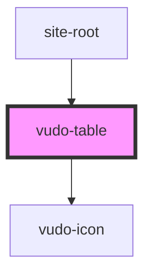

# vudo-table

<!-- Auto Generated Below -->

## Properties

| Property       | Attribute        | Description | Type                 | Default                                                 |
| -------------- | ---------------- | ----------- | -------------------- | ------------------------------------------------------- |
| `currentPage`  | `current-page`   |             | `number`             | `1`                                                     |
| `data`         | --               |             | `TableDataInterface` | `{     columns: [],     rows: [],     actions: {},   }` |
| `itemsPerPage` | `items-per-page` |             | `number`             | `100`                                                   |

## Events

| Event         | Description | Type                                |
| ------------- | ----------- | ----------------------------------- |
| `searchTable` |             | `CustomEvent<TableRowInterface[]>`  |
| `sortTable`   |             | `CustomEvent<TableColumnInterface>` |

## Dependencies

### Used by

 - [site-root](../../root)

### Depends on

- vudo-icon

### Graph

----------------------------------------------

*Built with [StencilJS](https://stenciljs.com/)*
