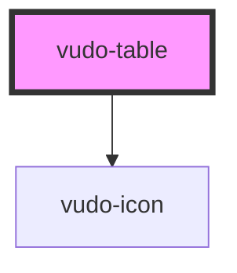

# component-table

<!-- Auto Generated Below -->

## Properties

| Property | Attribute | Description | Type                 | Default                                                 |
| -------- | --------- | ----------- | -------------------- | ------------------------------------------------------- |
| `data`   | --        |             | `TableDataInterface` | `{     columns: [],     rows: [],     actions: {},   }` |

## Dependencies

### Depends on

- vudo-icon

### Graph

----------------------------------------------

*Built with [StencilJS](https://stenciljs.com/)*
